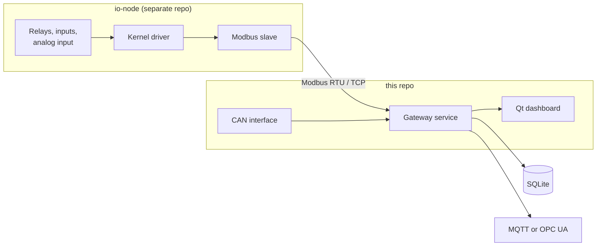

# embedded-linux-industrial

The main repo for a hands-on move from industrial controls engineering into embedded Linux.

The goal is a small, complete industrial system, built from scratch on a BeagleBone Black. It has a remote I/O module (the "IO-Node"), a Modbus stack written from the protocol spec, and a gateway that polls the I/O, logs it, and shows it on a dashboard. The code is written by hand in C and C++20 to build real fluency, including parts most projects would take from a library, like the Modbus stack.

## Planned system

Everything runs on a custom Linux image built with Buildroot and Yocto.

## What this repo holds

| Item | Status |
|---|---|
| [Roadmap](embedded-linux-roadmap.md): the phase-by-phase plan | Written |
| Phase 0: cross-compiling for the BeagleBone Black (`src/`) | In progress |
| Phase 4: SocketCAN app, which grows into the gateway's CAN interface | Planned |
| Phase 6: gateway service that polls Modbus devices, logs to SQLite, and publishes northbound over MQTT or OPC UA | Planned |
| Phase 6: Qt dashboard with live values and relay control | Planned |
| [CLAUDE.md](CLAUDE.md): instructions for an AI mentor that reviews and explains but doesn't write the project code | In use |

## What lives in other repos

Pieces that stand on their own, or that need a different build setup, get their own repo. Each one is created when its phase starts.

| Repo | Contents | Phases |
|---|---|---|
| `modbus` | Modbus library: RTU + TCP, master + slave, with tests. Used by both `io-node` and the gateway. | 3 |
| `io-node` | The remote I/O device: kernel driver, device tree overlay, test utility, Modbus slave daemon, real-time latency tester | 2, 3, 5 |
| `io-node-os` | Buildroot and Yocto configs for the board image, including the PREEMPT_RT kernel | 1, 5 |

Links will be added as each repo is created.

## Toolchain

- **Languages:** C for the kernel driver; C++20 for everything in userspace
- **Build:** hand-written GNU Make (CMake only for the Qt dashboard)
- **Target:** BeagleBone Black (32-bit ARM Cortex-A8), cross-compiled from x86-64 Linux with the `arm-linux-gnueabihf` toolchain

## Status

Phase 0 (foundation) is in progress as of September 2026, and the hardware is on its way. See the [roadmap](embedded-linux-roadmap.md) for the full plan.
